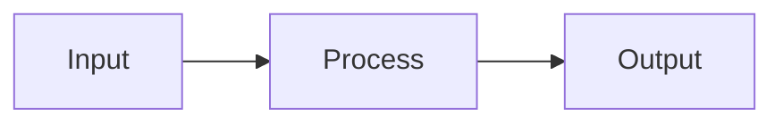

# Architecture

## Goals
<!-- Map to NFRs from requirements.md -->

## Proposed Solution

### Components
<!-- 
| Component | Responsibility | Location |
|-----------|---------------|----------|
-->

### Data Flow
<!-- 

-->

### Tech Choices
<!-- 
- Python for `dev/`
- Playwright + TypeScript for `test-automation/`
-->

## Contracts

### CLI/API Contract
<!-- Define inputs, outputs, error shapes -->

### File Inputs/Outputs
<!-- Paths, formats -->

### Error Handling Strategy
<!-- How errors are communicated -->

## Decisions (ADRs)

### ADR-001: <Decision Title>
<!-- 
**Context:** ...
**Decision:** ...
**Alternatives:**
1. ...
2. ...
**Consequences:** ...
-->

## Testing Strategy
<!-- 
- Unit/integration targets (Python)
- Verification targets (Playwright/TS)
-->

## Security Considerations
<!-- 
- Input validation
- Secrets handling
- Least-privilege assumptions
-->

## Risks
<!-- 
| Risk | Impact | Mitigation |
|------|--------|------------|
-->

## Open Questions
<!-- 
- None.
-->
