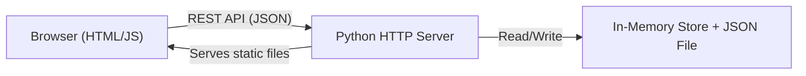
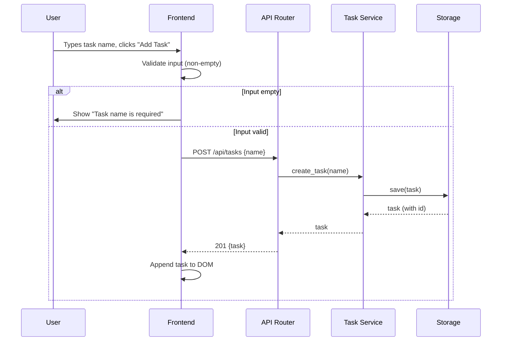
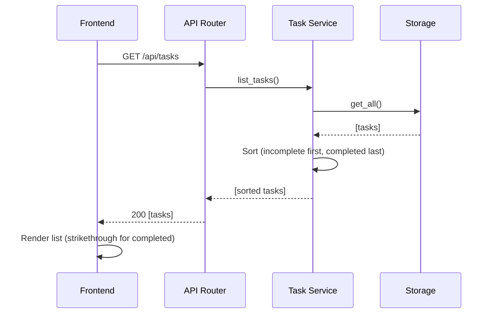
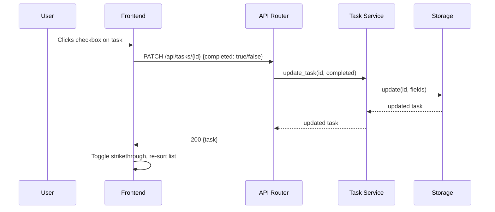
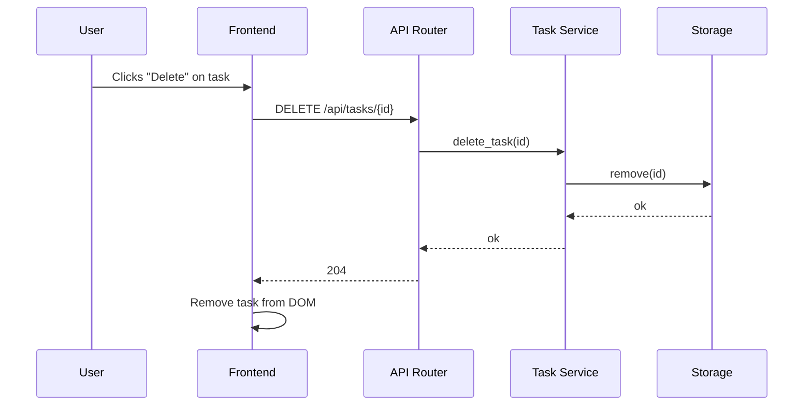
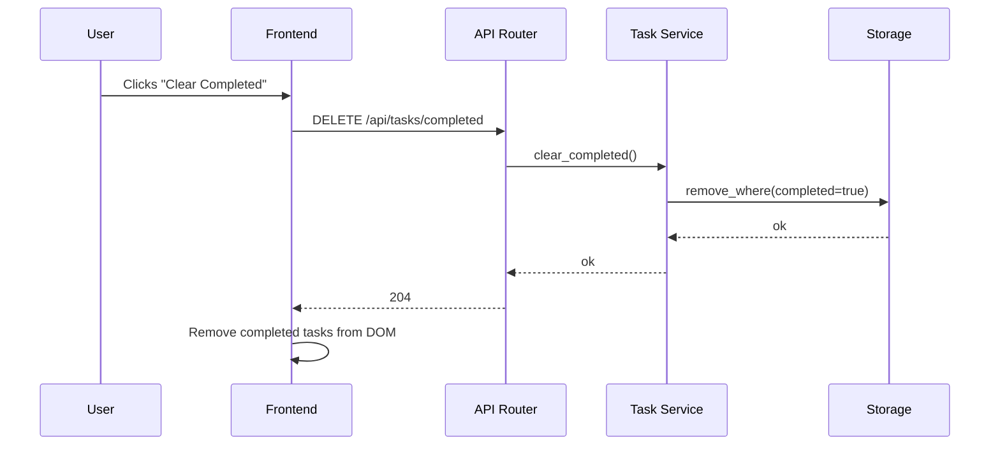

# Architecture

**Source:** [requirements.md](requirements.md)

## Goals

| Goal | Mapped NFR | Description |
|------|-----------|-------------|
| G-1  | NFR-1     | Single-page architecture: Python backend serves a REST API and static HTML/JS frontend. |
| G-2  | NFR-2     | No authentication or authorization layer. |
| G-3  | NFR-3     | Local data persistence via in-memory storage with optional JSON file backup; no external database. |
| G-4  | NFR-4     | Immediate UI feedback on add/complete/delete without full page reload. |

## Proposed Solution

### High-Level Overview

The system is a single-page Task Manager web application running on `localhost`. A Python HTTP server serves both the REST API and the static frontend assets. The frontend communicates with the backend exclusively through JSON-over-HTTP API calls. Task data is held in an in-memory data structure and optionally persisted to a local JSON file.



### Components

| Component | Responsibility | Location |
|-----------|---------------|----------|
| **HTTP Server** | Starts the application, binds to `localhost`, routes requests to the API handler or static-file handler. | `dev/src/app/server.py` |
| **API Router** | Maps HTTP methods + paths to handler functions for task CRUD operations. | `dev/src/app/routes.py` |
| **Task Service** | Implements business logic: create, list, toggle-complete, delete, clear-completed, sort (completed-to-bottom). | `dev/src/app/service.py` |
| **Storage Layer** | Manages the in-memory task collection; handles read/write to a local JSON file for persistence across restarts. | `dev/src/app/storage.py` |
| **Frontend** | Single HTML page with embedded or linked JS/CSS; renders the task list, captures user actions, calls the REST API, and updates the DOM. | `dev/src/app/static/index.html` |

### Data Flow

#### Add Task (FR-2, FR-5)



#### List Tasks (FR-1, FR-6)



#### Mark Complete / Incomplete (FR-3)



#### Delete Task (FR-4)



#### Clear Completed (FR-7)



### Tech Choices

| Technology | Purpose | Rationale |
|-----------|---------|-----------|
| Python 3.x standard library (`http.server`, `json`) | Backend HTTP server + API | Satisfies NFR-1; zero external dependencies; sufficient for single-user localhost use. |
| Vanilla HTML / CSS / JS | Frontend SPA | No build step needed; satisfies NFR-4 via DOM manipulation; keeps `dev/` free of Node tooling. |
| In-memory `dict` + JSON file | Persistence | Satisfies NFR-3; simple, no external DB; JSON file survives restarts. |
| UUID4 strings | Task IDs | Collision-free without coordination; no auto-increment state to manage. |
| Playwright + TypeScript | End-to-end verification | Lives in `test-automation/`; validates acceptance criteria against the running app. |

## Contracts

### REST API Contract

Base path: `/api/tasks`

#### `GET /api/tasks`

List all tasks, sorted with incomplete tasks first and completed tasks last (FR-6).

- **Request:** No body.
- **Response `200`:**
  ```json
  [
    { "id": "uuid-string", "name": "Buy groceries", "completed": false },
    { "id": "uuid-string", "name": "Old errand",    "completed": true  }
  ]
  ```

#### `POST /api/tasks`

Create a new task.

- **Request:**
  ```json
  { "name": "Buy groceries" }
  ```
- **Response `201`:**
  ```json
  { "id": "uuid-string", "name": "Buy groceries", "completed": false }
  ```
- **Response `400`:**
  ```json
  { "error": "Task name is required" }
  ```

#### `PATCH /api/tasks/{id}`

Update a task's completion status.

- **Request:**
  ```json
  { "completed": true }
  ```
- **Response `200`:**
  ```json
  { "id": "uuid-string", "name": "Buy groceries", "completed": true }
  ```
- **Response `404`:**
  ```json
  { "error": "Task not found" }
  ```

#### `DELETE /api/tasks/{id}`

Delete a single task.

- **Response `204`:** No body.
- **Response `404`:**
  ```json
  { "error": "Task not found" }
  ```

#### `DELETE /api/tasks/completed`

Remove all completed tasks (FR-7).

- **Response `204`:** No body.

### Static File Serving

The HTTP server shall serve all files under `dev/src/app/static/` at the root URL path `/`. A request to `/` shall return `index.html`.

### Data Model

```
Task {
  id:        string   // UUID4, assigned by the backend on creation
  name:      string   // Non-empty, whitespace-trimmed
  completed: boolean  // Defaults to false on creation
}
```

Storage format (JSON file, when used):

```json
{
  "tasks": [
    { "id": "...", "name": "...", "completed": false }
  ]
}
```

File location: `dev/src/app/data/tasks.json` (created automatically if absent).

### Error Handling Strategy

| Scenario | HTTP Status | Response Shape |
|----------|-------------|----------------|
| Successful creation | 201 | `{ "id", "name", "completed" }` |
| Successful read/update | 200 | Task object or array |
| Successful delete | 204 | No body |
| Empty task name on POST | 400 | `{ "error": "Task name is required" }` |
| Task ID not found | 404 | `{ "error": "Task not found" }` |
| Malformed JSON body | 400 | `{ "error": "Invalid JSON" }` |
| Unsupported method/path | 405 | `{ "error": "Method not allowed" }` |

All error responses use `Content-Type: application/json`.

## Decisions (ADRs)

### ADR-001: Use Python Standard Library HTTP Server (No Framework)

**Context:** The backend needs to serve a REST API and static files. A framework (Flask, FastAPI) would simplify routing but adds an external dependency.

**Decision:** Use `http.server` from the Python standard library with a custom request handler.

**Alternatives:**
1. **Flask** — Lightweight, mature, excellent routing. Adds a `pip install` dependency and a `requirements.txt` entry.
2. **FastAPI + Uvicorn** — Async, auto-docs. Heavier dependency chain; overkill for a single-user localhost app.

**Consequences:**
- (+) Zero external Python dependencies; no virtual-environment complexity for reviewers.
- (+) Aligns with constraint "no external DB" minimal-dependency philosophy.
- (−) Manual routing logic; slightly more boilerplate for JSON parsing and response helpers.

### ADR-002: In-Memory Dict with JSON File Persistence

**Context:** NFR-3 requires local persistence without an external DB. Options range from pure in-memory to SQLite to flat files.

**Decision:** Store tasks in a Python `dict` keyed by task ID at runtime; serialize to a JSON file on every write.

**Alternatives:**
1. **Pure in-memory (no file)** — Simplest, but data lost on restart.
2. **SQLite** — Relational queries, ACID. Adds complexity beyond what a list of tasks needs.

**Consequences:**
- (+) Data survives server restarts.
- (+) Human-readable storage file; easy to inspect and debug.
- (−) Write-on-every-mutation has minor I/O cost (acceptable for single-user).
- (−) No transactional guarantees (acceptable per A-1 single-user assumption).

### ADR-003: Vanilla HTML/JS Frontend (No Framework)

**Context:** The frontend must render a task list and communicate with the API. A framework (React, Vue) would provide reactivity but adds a build step and Node tooling inside `dev/`.

**Decision:** Use a single `index.html` with inline or linked vanilla JS and CSS.

**Alternatives:**
1. **React (via CDN)** — Component model, virtual DOM. Adds CDN dependency; unfamiliar to some reviewers.
2. **Vue (via CDN)** — Reactive data binding. Same CDN dependency trade-off.

**Consequences:**
- (+) No build step, no Node tooling in `dev/`.
- (+) Entire frontend is a single inspectable file.
- (−) DOM manipulation code is more verbose than framework equivalents.

### ADR-004: Client-Side Empty-Input Validation with Server-Side Backup

**Context:** FR-5 requires showing "Task name is required" on empty input. Validation can live in the frontend, backend, or both.

**Decision:** Validate on the client side for immediate feedback (NFR-4). The server also validates and returns `400` for defense-in-depth.

**Alternatives:**
1. **Client-side only** — Fast feedback, but API is unprotected against direct calls.
2. **Server-side only** — Secure, but requires a round-trip for simple validation feedback.

**Consequences:**
- (+) Immediate UI error message (NFR-4).
- (+) API is self-protecting; Playwright tests can verify both layers.
- (−) Duplicated validation logic (minimal cost for a single rule).

## Testing Strategy

### Python Unit / Integration Tests (`dev/tests/`)

| Target | What to verify |
|--------|---------------|
| Task Service | `create_task`, `list_tasks`, `update_task`, `delete_task`, `clear_completed`; sorting logic (FR-6). |
| Storage Layer | Read/write to in-memory dict; JSON file serialization/deserialization. |
| API Router | Correct HTTP status codes and response shapes for all endpoints; error cases (400, 404). |

### Playwright + TypeScript Verification (`test-automation/tests/`)

| Target | What to verify |
|--------|---------------|
| FR-1 / AC-1 | Page load shows existing tasks. |
| FR-2 / AC-2 | Adding a task updates the list without reload. |
| FR-3 / AC-3 | Checkbox toggles strikethrough styling. |
| FR-4 / AC-4 | Delete button removes task from the list. |
| FR-5 / AC-5 | Empty input shows "Task name is required". |
| FR-6 / AC-6 | Completed tasks appear at the bottom. |
| FR-7 / AC-7 | "Clear Completed" removes all completed tasks. |
| Doc quality | `docs-quality.spec.ts` validates doc structure and traceability. |

## Security Considerations

- **Input validation:** Task name is validated for non-empty on both client and server. Server trims whitespace and enforces a reasonable max length (e.g., 200 characters) to prevent oversized payloads.
- **No secrets:** No API keys, tokens, or credentials are used (NFR-2). Nothing to leak.
- **Localhost only:** The server binds to `127.0.0.1`, not `0.0.0.0`, preventing LAN exposure.
- **Content-Type enforcement:** The API checks `Content-Type: application/json` on requests with bodies; rejects others with `400`.
- **Path traversal:** Static file serving is restricted to the `static/` directory; the handler rejects paths containing `..`.

## Risks

| # | Risk | Impact | Likelihood | Mitigation |
|---|------|--------|------------|------------|
| R-1 | Data loss on crash before JSON flush | Lost tasks since last write | Low (single-user, writes are immediate) | Write-after-every-mutation strategy; accept trade-off per A-1. |
| R-2 | Manual HTTP routing errors (ADR-001) | Broken endpoints, missed edge cases | Medium | Comprehensive unit tests for all routes; Playwright E2E coverage. |
| R-3 | `DELETE /api/tasks/completed` path conflicts with `DELETE /api/tasks/{id}` | Router matches wrong handler | Low | Route matching checks for the literal `completed` segment before treating the segment as an ID. |
| R-4 | Large JSON file degrades performance | Slow reads/writes | Very Low (single-user, small dataset) | Acceptable for scope; document limit if needed. |

## Open Questions

- None.
